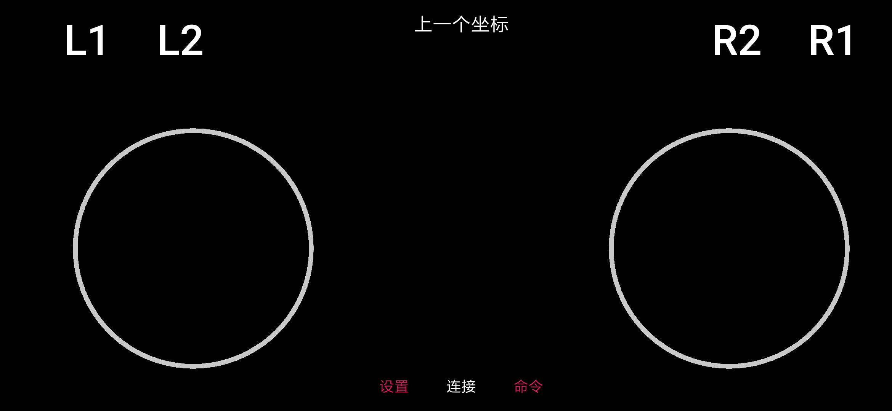

# BluetoothController

一个适合蓝牙小车的安卓app遥控程序。



# Quick Start

该应用程序有两个圆盘。 每次，程序读取左右手指的坐标。 然后将左光盘的x坐标和右光盘的y坐标连接在一起，并通过蓝牙串行发送。

消息格式看起来像`-23,45 \ r \ n`。 控制小车时，您可以简单地将其转换为两个车轮的速度。

$$
\begin{cases}
v_\text{left} - v_\text{right} = 2 x\\
v_\text{left} + v_\text{right} = 2 y
\end{cases}
\quad
\Rightarrow
\quad
\begin{cases}
v_\text{left} = x + y\\
v_\text{right} = y - x
\end{cases}
$$

如果您使用的是Arduino，则可以使用以下代码来驱动蓝牙小车：
```c++
void loop() {
    if(Serial.available()) {
        int x = Serial.parseInt();
        int y = Serial.parseInt();
        int left = x + y, right  = y - x;
        drive(left, right); // your car driving function
    }
}
```

可以自定义命令格式，量化，发送频率和控制方法。

# Fast Command
顶部的L1，L2，R1，R2按钮可以方便地发送预定义的命令。 您可以在“设置”中更改默认命令。

# Tricks

命令生成基于格式化字符串。
```
String cmd = String.format(format, x, y);
```

特殊格式可以使编程更简单：

`"%+04d, %+04d"` 补全前导零，那么您可以使用:```100 * buf[0] + 10 * buf[1] + buf[2]``` 来将字符串转换为整数。

`"%2$d, %1$d"` 可以交换x和y坐标，有时会有所帮助。

`"C%+04d%+04d"` 可以在每个坐标消息中创建一个字符“ C”。 您可以轻松地将坐标消息与其他命令区分开。
